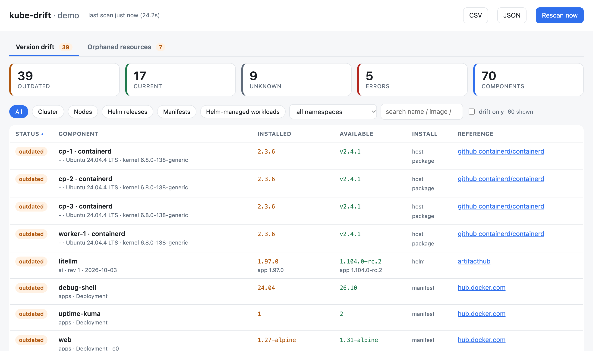
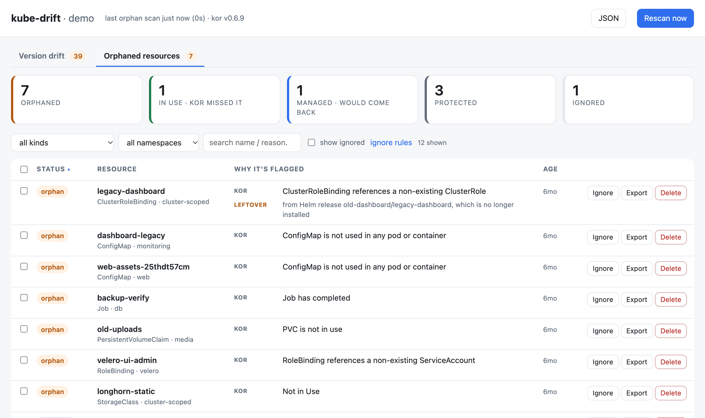

# kube-drift

A dashboard for the two kinds of drift a long-lived Kubernetes cluster collects:

- **Version drift** — everything installed (control plane, nodes, Helm releases, plain
  manifests), what upstream has released since, and where to read the release notes.
- **Orphaned resources** — ConfigMaps, Secrets, RoleBindings, PVCs… that nothing uses any more,
  found by [kor](https://github.com/yonahd/kor) and cross-checked so you can tell real leftovers
  from things kor can't see being used.

It runs in the cluster, rescans on a timer, and is **read-only**: it never changes the cluster.
Cleanup is a kubectl script it writes for you to review and run.




## Quick start

```bash
kubectl apply -k 'https://github.com/opswhisperer/kube-drift//deploy/base?ref=main'
kubectl -n kube-drift port-forward svc/kube-drift 8080:80
```

Open <http://localhost:8080>. The first version scan takes under a minute; the orphan scan a few
minutes (kor lists every kind in every namespace).

You need a default StorageClass (kube-drift keeps its state on a 1Gi PVC). Images are published
for `linux/amd64` and `linux/arm64`.

## Configure

kube-drift needs no configuration to start: it finds every release, workload and orphan on its
own, looks Helm charts up on ArtifactHub by name, and compares images with newer tags in their
registry. Add a config file when the dashboard shows you something wrong or noisy:

| On the dashboard | Add to `config.yaml` |
|---|---|
| A Helm release is **unknown**, or "Available" belongs to a different chart | `helm:` — where that chart is really published |
| "Available" is a major upgrade you can't take yet | `track: major` on that image (`images:`) or release (`helm:`) |
| An app on `latest`/`main` only says "newer image behind tag" | `probes:` — ask the app for its version over HTTP |
| Images from your own registry show errors | `registries:` — plain HTTP, credentials |
| Rows you'll never act on | `ignore:` (workloads), `ignore_images:` (sidecars), `groups:` (many generated copies → one row) |
| Orphans that are fine | `orphans.ignore:` — or **Ignore** in the dashboard |

[`config/example.yaml`](config/example.yaml) explains each key with examples. Copy it, keep what
you need.

### Applying your config

The config is a file called `config.yaml` that Kustomize turns into the ConfigMap kube-drift
reads. Make a directory with two files:

```yaml
# my-kube-drift/kustomization.yaml
resources:
  - https://github.com/opswhisperer/kube-drift//deploy/base?ref=main   # kube-drift itself
configMapGenerator:
  - name: kube-drift-config     # replace the base's default config…
    behavior: replace
    files:
      - config.yaml             # …with this file
```

```yaml
# my-kube-drift/config.yaml
cluster_name: prod-eu                # shown in the dashboard header

helm:
  # the ArtifactHub search for "postgresql" picked the wrong chart; this release is Bitnami's
  db: { source: { type: artifacthub, repo: bitnami, chart: postgresql } }

images:
  mongo: { track: major }            # we're staying on MongoDB 8 for now: don't offer 9

ignore:
  - { namespace: default, name: debug-shell }   # a scratch pod, not worth tracking

orphans:
  kubectl_context: prod-eu           # the cleanup commands it writes target this context
  ignore:
    - { kind: Secret, source: cert-manager, why: cert-manager owns its certificates }
```

Then `kubectl apply -k my-kube-drift/`. To change the config, edit `config.yaml` and apply again;
the pod restarts by itself (the ConfigMap's name includes a hash of its contents).

The same directory is where the rest of your customisation goes: another namespace
(`namespace:`, plus a `$patch: delete` for the base's Namespace), your own image build
(`images:`, and a patch adding `imagePullSecrets`), and an Ingress or Gateway.

Optional: a Secret named `kube-drift-credentials` in kube-drift's namespace with a
`github-token` key raises the GitHub API limit from 60 to 5000 requests an hour, for chart and
probe lookups that use GitHub releases. Private-registry credentials are covered under
`registries:` in [`config/example.yaml`](config/example.yaml).

### Exposing it

The dashboard has no login. Its only writes are its own state (ignores and rescans), but it shows
your cluster's inventory, so keep it on port-forward or put it behind your ingress's
authentication (oauth2-proxy, an identity-aware proxy, a VPN…).

## Version drift

| Category | Installed version from | Available version from |
|---|---|---|
| Cluster | `/version`; static pods in `kube-system` (etcd, kube-vip, apiserver…) | `dl.k8s.io/release/stable-<minor>.txt` and `stable.txt`; registry tags |
| Nodes | kubelet and container runtime per node | Kubernetes stable pointer; GitHub `containerd/containerd` |
| Helm releases | Helm v3 release Secrets (chart version + appVersion) | ArtifactHub, an OCI chart repo, or GitHub releases |
| Manifests | every Deployment/StatefulSet/DaemonSet not owned by Helm | newest registry tag of the same shape as the running tag |
| Helm-managed workloads | the images inside Helm releases (hidden by default) | same as manifests |

Pinned tags are matched by shape: `v1.35.9` only considers `vX.Y.Z` tags, `9.0-alpine` only
`X.Y-alpine`, `distroless-v1.39.1` only `distroless-vX.Y.Z`. `track: minor|major` limits the
answer to the installed minor/major and shows the unrestricted one as "newer track".
Prereleases are ignored.

Floating tags (`latest`, `main`, `nightly`…) carry no version, so the running image digest is
compared with the registry's current digest for that tag ("newer image behind tag"). Apps that
report their version over HTTP can be asked directly with `probes`.

## Orphaned resources

kor does the detection. By default kube-drift runs everything `kor all` checks except CRDs
(slow, and mostly operator-installed CRDs), with `--ignore-owner-references` — anything with an
owner is garbage-collected with it, so it is never really orphaned — and `--older-than=1h`, so
nothing mid-rollout is flagged.

Then it adds what kor doesn't check. Each row shows kor's reason (tagged **kor**) and
kube-drift's evidence (**In use**, **Recreated**, **Leftover**):

| Status | Meaning |
|---|---|
| orphan | nothing uses or manages it. **Leftover** means the Helm release that created it is no longer installed |
| in use | kor is wrong: something it doesn't check uses it — a Gateway's TLS `certificateRefs`, a cert-manager issuer's secret refs |
| managed | its owner would put it back if deleted: an installed Helm release, a cert-manager Certificate, Argo CD, a `managed-by` label. Remove it at the source instead |
| protected | never gets a delete command: `system:*`/`kubeadm:*` objects, kubeadm and `kube-root-ca.crt` ConfigMaps, kube-drift itself, plus your `protect` rules |
| ignored | you ignored it, or an ignore rule matches |

**Ignore** a resource, or everything like it: the dialog offers rules built from your selection
with live match counts — "Secrets issued by cert-manager (65)", "ConfigMaps in apps" — that
also cover future findings. Rules match on `kind`, `namespace`, `name`, `name_regex` and `source`
(the evidence: `cert-manager`, `gateway`, `cert-manager-issuer`, `helm`, `helm-leftover`,
`argocd`, `managed-by:<name>`). Rules made in the dashboard live on its PVC and can be removed
under "ignore rules"; rules in the config file work the same way.

**Export** and **Delete** give you a script to copy into a terminal with your own kubectl
access (needs `kubectl` and `jq`). It saves each object to
`kube-drift-{export,backup}-<timestamp>/<Kind>_<namespace>_<name>.json`, with server-owned
fields stripped so `kubectl apply -f <dir>/` restores it, and the delete script removes each
object only after its backup succeeded, stopping at the first failure. Secret backups contain the
secret data and are written with mode 600. A PVC or PV backup is the manifest, not the data.

## Security

- **Read-only RBAC**: `get`/`list` on what the scans read, cluster-wide. That includes Secrets:
  Helm stores releases as Secrets, and kor checks whether Secrets are used. Kubernetes RBAC
  can't limit a list to one Secret type or label. Remove `secret` from `orphans.resources` to
  keep kor out of Secrets; the Helm scan still reads them.
- The dashboard and API never return Secret data — only names.
- Runs as non-root with a read-only root filesystem and no capabilities.
- POST endpoints change only kube-drift's own state, and the ignore endpoints accept
  `application/json` only, so a cross-site form can't reach them.

## API

Described by OpenAPI 3.1 at `/openapi.json`, with an interactive reference at `/docs` (also the
**API** button in the dashboard). API responses carry `Link: </openapi.json>; rel="service-desc"`,
so tools and agents can discover it from any endpoint.

| | |
|---|---|
| `GET /api/drift` | version scan (JSON) |
| `GET /api/drift.csv` | version scan (CSV) |
| `GET /api/orphans` | orphan scan, with ignores and rules applied |
| `POST /api/rescan[?scope=versions\|orphans]` | rescan now |
| `POST /api/orphans/ignore`, `/unignore` | `{ids, note}` |
| `POST /api/orphans/rules`, `/rules/delete` | `{rule, note}`, `{id}` |
| `POST /api/orphans/commands` | `{ids, action: export\|delete}` → `{script, skipped}` |
| `GET /healthz`, `/readyz` | liveness; readiness (503 until the first version scan) |
| `GET /openapi.json`, `/docs` | this API, as OpenAPI 3.1 and as Swagger UI |

Environment: `CONFIG` (`/config/config.yaml`), `CLUSTER_NAME` (overrides the config),
`SCAN_INTERVAL_HOURS`, `DATA_DIR` (`/data`), `GITHUB_TOKEN`, plus any `auth_env` you name under
`registries`.

## Development

Python 3.12 and PyYAML; `kor`, `kubectl` and `jq` for the full picture.

```bash
pip install -r requirements.txt
python3 -m unittest discover -s tests -p 'test_*.py'

# against a frozen snapshot of a real cluster, no cluster access needed
python3 -m tests.offline              # version scan, real upstream lookups
python3 -m tests.offline --orphans    # orphan scan against a recorded kor result

# against your current kubectl context
kubectl proxy &
KUBE_API=http://127.0.0.1:8001 CONFIG=config/example.yaml DATA_DIR=/tmp/kube-drift \
  python3 -m app.main                 # http://localhost:8080
```

```
app/main.py      HTTP server, scan schedulers, ignore/rule/command endpoints
app/scan.py      version scan: inventory → components → upstream versions
app/orphans.py   orphan scan: kor, evidence, ignore rules, cleanup scripts
app/upstream.py  registries (Docker Hub, ghcr, quay, generic v2), ArtifactHub, GitHub
app/k8s.py       minimal Kubernetes API client, Helm release decoding
app/store.py     ignores and rules on the data volume
app/static/      the dashboard (one HTML file, no build step)
config/          example.yaml — every config key
deploy/base      Kustomize base: namespace, RBAC, PVC, Deployment, Service
tests/           unit tests, plus a snapshot of a real cluster for offline runs
```

## License

[Apache License 2.0](LICENSE). The image bundles [kor](https://github.com/yonahd/kor) (MIT),
PyYAML (MIT) and [Swagger UI](https://github.com/swagger-api/swagger-ui) (Apache-2.0); see [NOTICE](NOTICE).
